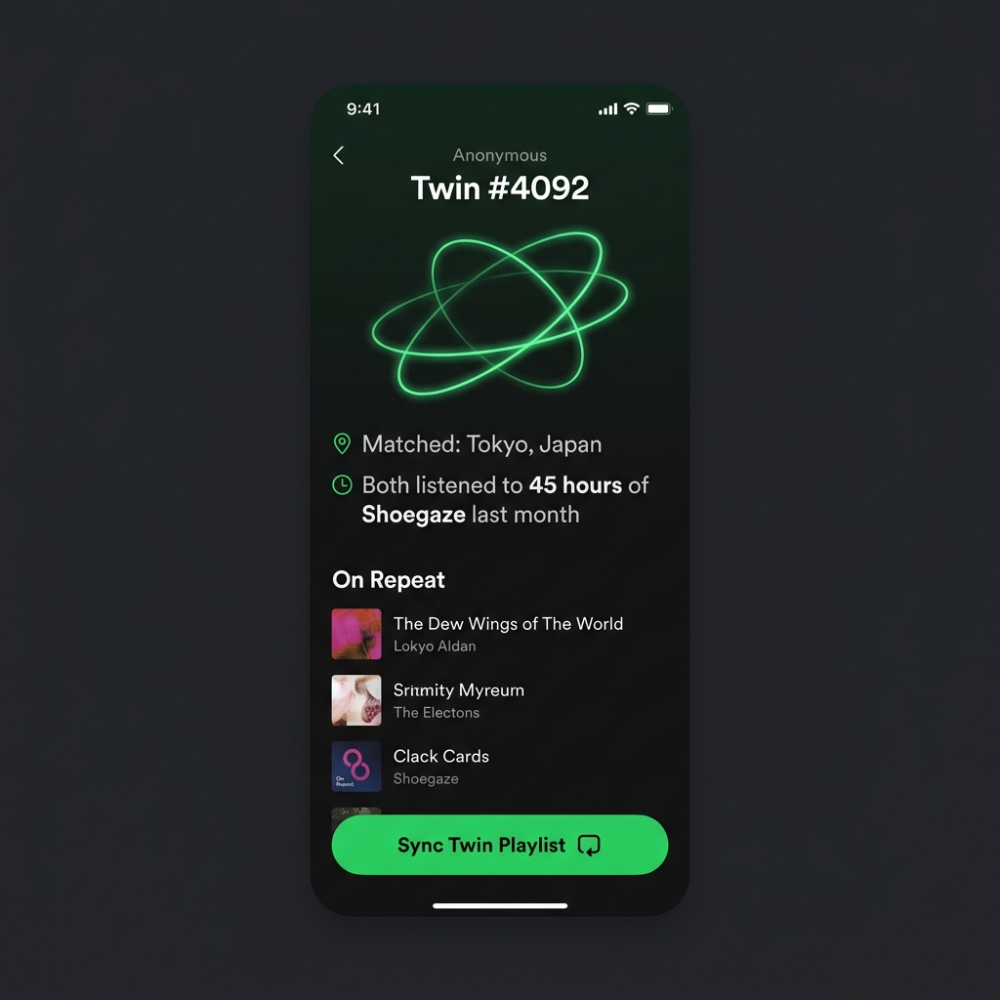

# 🎵 Spotify "Orbit" Case Study: Humanizing Music Discovery

This repository contains a comprehensive B2C Product Management case study proposing **Spotify Orbit**—a social music discovery feature designed to bridge the gap between purely mathematical algorithms and organic human connection.

---

## 🚀 The Vision: "Spotify Orbit"

While Spotify’s algorithmic engines (like *Discover Weekly* and *Daily Mix*) are world-class, they frequently cause **algorithmic fatigue**. Users find themselves stuck in listening echo chambers. 

**Spotify Orbit** introduces an anonymous, privacy-first global matchmaking mechanism. It pairs you with your **"Music Twin"** (someone with >90% listening overlap) so you can explore their heavy rotation and instantly expand your musical horizons through real human curation.

  

---

## 📂 Case Study Breakdown

Read the full analysis and proposal in [Spotify.md](./Spotify.md). Below is a summary of the framework:

### 1. [Executive Summary](./Spotify.md#1-executive-summary)
* **The Problem:** The absence of an organic, social discovery loop leading to repetitive recommendations and decreased session exploration.
* **The Goal:** Boost active user engagement, daily session length, and stream counts of long-tail artists.
* **The Solution:** Anonymously matching listening profiles to create a "Music Twins" network.

### 2. [User Personas & Pain Points](./Spotify.md#2-user-personas--pain-points)
* **"Stuck-in-a-Rut Ryan" (Millennial Commuter):** Needs trusted, non-mathematical recommendations.
* **"Tastemaker Tara" (Gen Z College Student):** Wants a frictionless medium to share niche vibes.

### 3. [Ideation & Prioritization (RICE Framework)](./Spotify.md#4-prioritization-matrix-rice-framework)
To select the MVP, we evaluated three distinct ideas using the **RICE framework** (Reach × Impact × Confidence / Effort):
* **Track Swipe ("Tinder for Music")** — RICE Score: 4,200 (Priority #2)
* **Spotify Orbit (Music Twins)** — **RICE Score: 6,400 (Winner / Priority #1)**
* **Local Geo-Drops (AR Location Music)** — RICE Score: 800 (Priority #3)

### 4. [MVP Feature Details](./Spotify.md#5-the-solution-orbit-mvp)
* **The Match:** A clean Home Feed card highlighting listening overlaps (e.g., *Shoegaze* listener in Tokyo).
* **The Orbit View:** A stylized profile (`Twin #4092`) displaying current heavy rotation and playlists.
* **The Action:** Frictionless saving with a one-tap **"Sync Twin Playlist"** button.

### 5. [Go-to-Market & Metrics](./Spotify.md#6-go-to-market-gtm-strategy)
* **Launch Windows:** Strategically timed during mid-year off-peak periods (July/August) to maintain conversational buzz outside of *Spotify Wrapped*.
* **Growth Loops:** Instagram Stories / TikTok social sharing assets generated dynamically.
* **KPI Funnel (AARRR):** Focused on adoption rate, track save rates, retention return rate, and daily average session duration.

---

## 🛠️ Product Management Skillset Demonstrated

This case study showcases the following PM capabilities:
* **Product Strategy & Ideation:** Transforming qualitative pain points into validated product concepts.
* **Rigorous Prioritization:** Utilizing the RICE Framework to balance impact and engineering feasibility.
* **Go-To-Market (GTM) Planning:** Design of virality loops and marketing timing.
* **Data & Analytics (KPI Design):** Structuring success criteria around the AARRR funnel.
* **Risk & Privacy Mitigation:** Ensuring GDPR/privacy-first considerations within consumer products.

---

*Explore the full detailed case study in **[Spotify.md](./Spotify.md)**.*